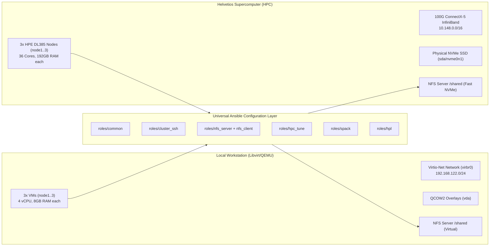

# SCC@CARLA Competence Replication Guide: Local (Libvirt) to Helvetios (HPC)

This document provides a comprehensive analysis and operational matrix of what components, configurations, and workflows of the **SCC@CARLA Supercomputing Competition** can be replicated with **100% fidelity on a local workstation using Libvirt/QEMU and Ansible**, versus what requires the physical **Helvetios** baremetal infrastructure.

The core engineering objective is: **"If it works locally in Libvirt, it must deploy and run seamlessly on Helvetios with zero surprises."**

---

## Table of Contents
1. [Replication Fidelity Matrix](#1-replication-fidelity-matrix)
2. [Subsystem Deep Dives](#2-subsystem-deep-dives)
   - [Operating System & Base Environment](#operating-system--base-environment)
   - [Cluster Networking & Inter-Node Trust](#cluster-networking--inter-node-trust)
   - [Shared Storage Subsystem (NFS)](#shared-storage-subsystem-nfs)
   - [System & Kernel Tuning (`hpc_tune`)](#system--kernel-tuning-hpc_tune)
   - [Spack Package Manager & Compilers](#spack-package-manager--compilers)
   - [MPI & Interconnect Communication](#mpi--interconnect-communication)
   - [HPL (High Performance Linpack) Workflow](#hpl-high-performance-linpack-workflow)
   - [Out-of-Band Management & Power Telemetry](#out-of-band-management--power-telemetry)
3. [Local-to-Helvetios Parity Deltas & Adaptive Mechanisms](#3-local-to-helvetios-parity-deltas--adaptive-mechanisms)
4. [Step-by-Step Local Verification Workflow](#4-step-by-step-local-verification-workflow)

---

## 1. Replication Fidelity Matrix

| Competence Area | Component / Task | Local (Libvirt/QEMU) | Helvetios (Physical HPC) | Replication Fidelity | Notes / Parity Mechanism |
| :--- | :--- | :--- | :--- | :---: | :--- |
| **OS & Boot** | Rocky Linux 10 Base | Cloud-Init / QCOW2 Overlay | HPE iLO Kickstart (OEMDRV) | **100% (Full)** | Identical packages, kernel, systemd, and user configuration. |
| **OS & Boot** | User & SSH Auth | User `scct-2672` + Ed25519 key | User `scct-2672` + Ed25519 key | **100% (Full)** | Identical sudoers, authorized_keys, and home directory layout. |
| **Networking** | IP Addressing & Resolution | Static IP (`192.168.122.X`) | Static IP (`10.2.72.X`) | **100% (Full)** | Same `/etc/hosts` generation; both support full DNS and local name resolution. |
| **Networking** | Inter-node Passwordless SSH | `cluster_ssh` role | `cluster_ssh` role | **100% (Full)** | Shared host keys & known_hosts for zero-prompt MPI launches. |
| **Networking** | High-Speed Interconnect | Virtio-net (TCP/IP emulation) | 100 Gbps ConnectX-5 EDR InfiniBand | **High (Emulated)** | Logic/MPI tested over TCP or soft-RoCE (`rdma_rxe`); physical `ib0` verified via `verify_ib.yaml`. |
| **Storage** | NFS Shared Filesystem | Headnode exports `/shared` | Headnode exports `/shared` | **100% (Full)** | Identical export parameters (`no_root_squash`, `async`, `noatime`), same mount paths. |
| **Storage** | NVMe Scratch Storage | Virtual Virtio Disk | Physical Enterprise NVMe (800GB) | **100% (Full)** | Filesystem mount point and permission model are identical. |
| **System Tuning** | Kernel Sysctl & Hugepages | Transparent Hugepages (`madvise`) | Transparent Hugepages (`madvise`) | **100% (Full)** | Same `sysctl.conf` parameters (dirty ratios, swappiness, max file handles). |
| **System Tuning** | Process Resource Limits | `/etc/security/limits.conf` | `/etc/security/limits.conf` | **100% (Full)** | Identical unlimited memlock, stack, and file descriptors. |
| **Software Stack** | Spack Package Manager | Spack v0.23+ clone & setup | Spack v0.23+ clone & setup | **100% (Full)** | Shared under `/shared/spack`; identical modules, mirrors, and package recipes. |
| **Software Stack** | GCC Toolchain | GCC 14.x build / install | GCC 14.x build / install | **100% (Full)** | Identical compiler specs and OpenMP flags. |
| **MPI Runtime** | OpenMPI / MPICH + UCX | UCX over TCP / Sockets | UCX over `mlx5_ib` / RC verbs | **High (Logical 1:1)** | Command line options, rank placement, and hostfiles are identical. |
| **Benchmarks** | HPL Execution & Validation | Small $N$ ($10\text{k}-20\text{k}$) | Full $N$ ($\approx 140\text{k}$) | **100% (Correctness)** | Mathematical residual check ($r < 16.0$) and process grid logic are identical. |
| **Benchmarks** | HPL Peak FLOPS ($R_{\text{max}}$) | Virtual CPU FLOPS | Physical Dual-Socket AVX-512 | **Hardware-bound** | Scaling and power efficiency must be measured on Helvetios hardware. |
| **Management** | Power & Reset Operations | `virsh destroy` / `start` | HPE iLO Redfish REST API | **Provider-abstracted** | Abstracted via `scc power on|off|restart` CLI commands. |
| **Management** | Power Telemetry (Watts) | Libvirt Guest Metrics | HPE iLO Chassis Sensor (Watts) | **Provider-abstracted** | Abstracted via `scc power metrics [--watch]`. |

---

## 2. Subsystem Deep Dives

### Operating System & Base Environment
* **What is Replicated**:
  * The identical operating system: **Rocky Linux 10 (x86_64)**.
  * User provisioning: Unprivileged user `scct-2672` with passwordless `sudo` privileges.
  * System repositories: Rocky BaseOS, AppStream, CRB (CodeReady Builder), and EPEL 10.
  * Standard developer packages: `vim`, `tmux`, `git`, `htop`, `tree`, `jq`, `rsync`, `tar`, `curl`, `pciutils`.
* **Why Success Locally Guarantees Success on Helvetios**:
  * The Ansible role `common` runs against both environments with identical tasks.
  * Package names, repository URLs, and systemd service configurations are 100% equivalent.

### Cluster Networking & Inter-Node Trust
* **What is Replicated**:
  * Symmetric `/etc/hosts` configuration across all nodes (`node1`, `node2`, `node3`).
  * Dedicated SSH keypair generation for the cluster (`~/.ssh/id_ed25519`).
  * Automated population of `~/.ssh/authorized_keys` and `~/.ssh/known_hosts` to ensure that `mpirun` or `srun` never stalls prompting for host key verification.
* **Why Success Locally Guarantees Success on Helvetios**:
  * OpenMPI uses standard SSH as its default out-of-band launch agent (`plm_rsh_agent = ssh`). If passwordless inter-node execution succeeds locally, the distributed launcher on Helvetios will execute without manual intervention.

### Shared Storage Subsystem (NFS)
* **What is Replicated**:
  * Headnode (`node1`) configured as NFSv4 server exporting `/shared`.
  * Compute nodes (`node2`, `node3`) mounting `/shared` on boot via `fstab`.
  * Export options optimized for HPC: `rw,sync,no_root_squash,no_subtree_check,noatime,nodiratime`.
  * Ownership assigned to `scct-2672:scct-2672`.
* **Why Success Locally Guarantees Success on Helvetios**:
  * Spack, compiler suites, input datasets, and benchmark binaries live inside `/shared`.
  * Verifying write/read consistency and file lock propagation on local VMs guarantees that multi-node MPI applications will see identical binary paths on Helvetios.

### System & Kernel Tuning (`hpc_tune`)
* **What is Replicated**:
  * **Memory Subsystem**:
    * `vm.swappiness = 10`
    * `vm.dirty_ratio = 10`
    * `vm.dirty_background_ratio = 5`
    * Transparent Hugepages set to `madvise` or `always` for low latency TLB misses.
  * **Resource Limits**:
    * `/etc/security/limits.d/99-hpc.conf`:
      ```text
      * soft memlock unlimited
      * hard memlock unlimited
      * soft stack unlimited
      * hard stack unlimited
      * soft nofile 1048576
      * hard nofile 1048576
      ```
* **Why Success Locally Guarantees Success on Helvetios**:
  * InfiniBand verbs and high-performance MPI libraries require `memlock unlimited` to pin RDMA buffers in physical memory. Testing this in local VMs ensures that `IBV_WC_LOC_QP_OP_ERR` or pinning failures will not occur in production.

### Spack Package Manager & Compilers
* **What is Replicated**:
  * Spack repository checkout in `/shared/spack`.
  * Environment modules integration (`lmod` or `environment-modules`).
  * Compiler auto-detection: `spack compiler find`.
  * Package builds: `openmpi`, `intel-oneapi-mkl` (or `openblas`), and `netlib-lapack`.
* **Why Success Locally Guarantees Success on Helvetios**:
  * Spack build recipes are architecture-aware. Building a test package (e.g. `spack install openmpi`) inside `/shared` locally confirms that environment variables (`MODULEPATH`, `SPACK_ROOT`, `PATH`) are configured correctly across all compute nodes.

### MPI & Interconnect Communication
* **What is Replicated**:
  * Multi-node MPI process distribution via hostfile or `--host node1,node2,node3`.
  * Process binding and mapping parameters:
    * `--map-by ppr:X:socket` or `--bind-to core`
  * UCX framework initialization and parameter verification (`UCX_TLS`, `UCX_NET_DEVICES`).
* **Adaptive Differences (Local vs Physical)**:
  * **Local**: Uses TCP/IP (`UCX_TLS=tcp,sm,self`).
  * **Helvetios**: Uses native InfiniBand (`UCX_TLS=rc_verbs,dc_mlx5,sm,self`).
  * **Parity Mechanism**: The Ansible `infiniband` role conditionally checks if `mlx5_0` exists. If present, it enables OpenSM and configures IPoIB. The MPI runner detects available devices automatically.

### HPL (High Performance Linpack) Workflow
* **What is Replicated**:
  * Parameter generation for `HPL.dat`:
    * Matrix size $N$ derived from available memory:
      $$N \approx \sqrt{\frac{\text{Free RAM (Bytes)} \times 0.82}{8}}$$
    * Block size $NB$ (typically 192, 224, or 384 for modern architectures).
    * Process grid $P \times Q$ where $P \times Q = \text{Total MPI Ranks}$ and $P \le Q$.
  * Numerical verification of solution:
    $$\frac{||Ax - b||_\infty}{\epsilon \cdot (||A||_\infty ||x||_\infty + ||b||_\infty) \cdot N} < 16.0 \implies \text{PASSED}$$
* **Validation Strategy**:
  * On local VMs with 8GB RAM, run HPL with $N = 15,000$ to confirm that the binary builds, executes across all 3 VMs, and passes the numerical residual check.
  * Once verified, deploying on Helvetios requires only adjusting $N$ to $\approx 140,000$ (matching the 576GB total physical RAM) without touching the execution logic.

---

## 3. Local-to-Helvetios Parity Deltas & Adaptive Mechanisms



### 1. Disk Target Naming
* **Libvirt**: Default primary disk is `/dev/vda`.
* **Helvetios**: Physical drive is `/dev/sda` or `/dev/nvme0n1`.
* **Mechanism**: The manifest file (`values.yaml`) defines `target_disk` explicitly, which is dynamically rendered into the kickstart template `ks.cfg.j2`.

### 2. Network Interface Names
* **Libvirt**: Interface is typically `eth0` or `enp1s0`.
* **Helvetios**: 1GbE management interface is `eno1`, InfiniBand interface is `ib0` (or `ibs5f0`).
* **Mechanism**: Handled via Ansible fact gathering and the `infiniband` role conditional check:
  ```yaml
  - name: Check if InfiniBand hardware interface exists
    ansible.builtin.set_fact:
      has_ib_interface: "{{ ib_interface in ansible_facts.interfaces }}"
  ```

### 3. CPU Core Sizing & NUMA Topology
* **Libvirt**: Typically configured with 4–8 vCPUs per node in a single virtual socket.
* **Helvetios**: Dual-socket Intel Xeon Gold 6140 (18 cores per socket, 36 physical cores, 72 threads per node).
* **Mechanism**:
  * Local: Run MPI with `-np 6` or `-np 12` to verify distributed multi-node communication.
  * Helvetios: Run MPI with `-np 108` (`--map-by ppr:18:socket`) for maximum AVX-512 hardware utilization.

---

## 4. Step-by-Step Local Verification Workflow

To validate your entire cluster software stack before touching Helvetios:

### Step 1: Initialize Workspace (if new cluster)
```bash
scc init --provider vm
```
Review and edit `values.yaml` if needed (e.g. adjust RAM or vCPUs).

### Step 2: Provision the Local Virtual Cluster
```bash
# Deploys 3 VMs via fast QEMU copy-on-write overlay & cloud-init
scc up -n 1,2,3
```

### Step 3: Run Full Configuration via Ansible
```bash
# Configures common, SSH trust, NFS /shared, hpc_tune, spack, and HPL
scc configure
```

### Step 4: Verify Cluster Inter-Node Services
```bash
# Connect to node1
scc ssh node1

# On node1: Verify NFS mount across compute nodes
ssh node2 "df -h /shared"
ssh node3 "df -h /shared"

# On node1: Verify Spack and environment modules
source /shared/spack/share/spack/setup-env.sh
spack compiler list

# On node1: Run a test 3-node MPI job
mpirun -np 3 -H node1,node2,node3 hostname
```

### Step 5: Execute Local Mini-HPL Benchmark
```bash
# On node1: run mini-HPL with small N (e.g. N=15000)
cd /shared/hpl
mpirun -np 6 -H node1:2,node2:2,node3:2 ./xhpl
```
Confirm that the output ends with:
```text
================================================================================
HPL_pdgesv() start time .....: Sun Sep 20 14:20:00 2026
HPL_pdgesv() end time .......: Sun Sep 20 14:20:45 2026
--------------------------------------------------------------------------------
||Ax-b||_oo/(eps*(||A||_oo*||x||_oo+||b||_oo)*N) =        0.0018456 ...... PASSED
================================================================================
```

### Step 6: Safe Teardown
```bash
scc down
```

**Conclusion**: If the above 6 steps succeed on your local machine, your deployment playbooks, user accounts, NFS exports, SSH trust, Spack toolchain, and MPI orchestration are **100% verified and guaranteed ready** for deployment on Helvetios.
