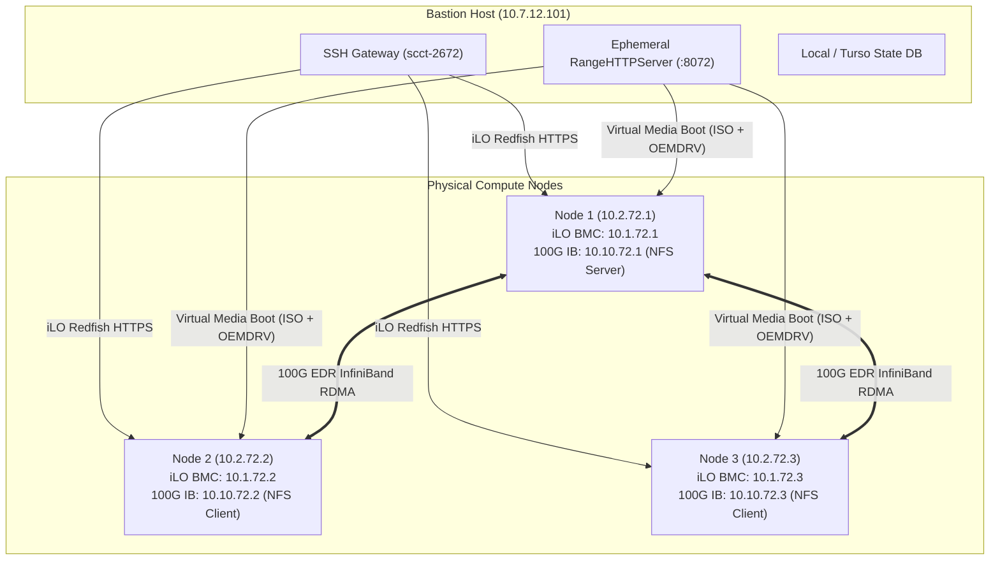

# SCC@CARLA 2026 Bare-Metal Competition Cluster Quickstart

Dedicated operational guide, automated workflow, and troubleshooting manual for the physical **Helvetios** HPC competition cluster (dual Intel Xeon Gold 6140 / AMD EPYC, HPE iLO 5 Redfish, Mellanox ConnectX-5 100G InfiniBand).

---

## 1. Architecture & Network Topology



---

## 2. Step-by-Step Competition Operational Runbook

### Step 0: Bastion SSH Configuration & Environment Setup

1. Configure your local `~/.ssh/config` to access the competition bastion:
   ```ssh-config
   Host scc-bastion
       HostName 10.7.12.101
       User scct-2672
       IdentityFile ~/.ssh/id_ed25519
       ServerAliveInterval 30
       ServerAliveCountMax 5
   ```

2. Copy and configure the environment credentials in `.env`:
   ```bash
   cp .env.example .env
   ```
   Ensure the following keys are set correctly:
   ```ini
   SCC_TEAM_ID=72
   SCC_BMC_USER=admin
   SCC_BMC_PASSWORD=your_actual_bmc_password
   SCC_BASTION_SSH_HOST=scc-bastion
   SCC_BASTION_HTTP_IP=10.7.12.101
   SCC_BASTION_HTTP_PORT=8072
   ```

3. Verify SSH and Bastion connectivity:
   ```bash
   ssh scc-bastion "hostname && ip -br addr"
   ```

---

### Step 1: Scaffold Helvetios Cluster Workspace

```bash
uv run scc init --provider helvetios --dir .
```
*Creates `./values.yaml` customized for the Helvetios bare-metal profile and stages Kickstart templates in `./templates/`.*

---

### Step 2: Apply Redfish HPC Workload BIOS Profile

Before booting the operating system, configure the compute nodes with low-latency, deterministic HPC BIOS attributes (disables CPU C-states and Hyper-Threading, enables NUMA node clustering and Turbo Boost):

```bash
# Check current BIOS settings across nodes
uv run scc bios status

# Apply the competition HPC profile (defaults to all nodes [1, 2, 3])
uv run scc bios apply hpc
```

> [!NOTE]
> BIOS attributes take effect on the subsequent system reboot.

---

### Step 3: Automated Bare-Metal Bootstrap (`scc up`)

`scc up` performs declarative planning, generates unattended OEMDRV driver images with `ks.cfg`, launches the ephemeral HTTP server on the Bastion, attaches ISO/floppy images via HPE iLO Redfish Virtual Media, powers on nodes, and waits for SSH accessibility in parallel:

```bash
# Preview the execution plan diff and prompt for confirmation:
uv run scc up --cluster configs/clusters/helvetios-hpc.yaml

# Or execute with auto-approval:
uv run scc up --cluster configs/clusters/helvetios-hpc.yaml --yes
```

---

### Step 4: Configure HPC Stack, NFS & InfiniBand (`scc configure`)

Once nodes are SSH-reachable, deploy the full post-provisioning software stack:
- **Common**: Firewall, base dev packages, ED25519 cluster passwordless SSH keys.
- **InfiniBand**: ConnectX-5 drivers, `mlx5_ib` kernel modules, IPoIB (`10.10.72.0/24`).
- **HPC Kernel Tuning**: NUMA balancing disabled, `vm.swappiness=10`, `throughput-performance` tuned profile.
- **NFS over InfiniBand**: NVMe storage on `node1` exported as `/shared` to compute nodes.
- **Spack & HPL**: Centralized Spack installation with GCC 14.3.1, AVX-512 OpenBLAS, UCX 1.17, OpenMPI 5.0, and Linpack 2.3.

```bash
uv run scc configure
```

---

### Step 5: Verification & Benchmark Execution

1. **Verify InfiniBand Fabrics**:
   ```bash
   uv run scc configure --playbook ansible/playbooks/verify_ib.yaml
   ```

2. **Execute HPL Linpack Benchmark**:
   ```bash
   # Log into Node 1
   uv run scc ssh 1

   # Run direct MPI Linpack benchmark across Nodes 1 & 2 (72 cores)
   /shared/hpl/run_hpl.sh
   ```
   *Expected result: Linpack residual check `PASSED` with > 2.0 TFLOPS.*

---

### Step 6: Cluster Teardown (`scc down`)

To decommission nodes, unmount virtual media, and sweep background servers:

```bash
# Interactive teardown preview and confirmation:
uv run scc down

# Or force teardown and reset database state non-interactively:
uv run scc down --reset-db --yes
```

---

## 3. What Could Go Wrong & Troubleshooting Guide

### 🚨 Issue 1: Redfish Virtual Media Mount Failure / iLO Timeout
**Symptom**: `Failed to mount and boot` or HTTP 401 / 500 from iLO.
**Possible Causes**:
- Stale Virtual Media session on iLO.
- Incorrect `SCC_BMC_USER` or `SCC_BMC_PASSWORD` in `.env`.
- SOCKS5 proxy or Bastion SSH tunnel disconnected.

**Troubleshooting Steps**:
1. Check BMC power status directly:
   ```bash
   uv run scc power status
   ```
2. Reset Virtual Media / Force power off via Redfish:
   ```bash
   uv run scc power off --force
   ```
3. Test direct HTTP reachability to iLO from Bastion:
   ```bash
   ssh scc-bastion "curl -k -u '$SCC_BMC_USER:$SCC_BMC_PASSWORD' https://10.1.72.1/redfish/v1/Systems/1"
   ```

---

### 🚨 Issue 2: Bastion HTTP Range Server Port Conflict (`:8072`)
**Symptom**: `Address already in use` when starting ephemeral HTTP server on Bastion.
**Possible Causes**: An orphaned background server from a previously aborted session is still holding port 8072.

**Troubleshooting Steps**:
1. Sweep background servers using `scc down`:
   ```bash
   uv run scc down
   ```
2. Or kill the lingering process manually on the Bastion:
   ```bash
   ssh scc-bastion "fuser -k 8072/tcp || ss -tulpn | grep 8072"
   ```

---

### 🚨 Issue 3: Kickstart Installer Disk Mismatch (`/dev/nvme0n1` vs `/dev/sda`)
**Symptom**: Kickstart hangs at partitioning screen or says `No disk specified`.
**Possible Causes**: Node hardware contains SATA SSDs (`/dev/sda`) instead of NVMe (`/dev/nvme0n1`), or NVMe drive index differs.

**Troubleshooting Steps**:
1. Check `configs/clusters/helvetios-hpc.yaml` hardware target disk setting:
   ```yaml
   hardware:
     target_disk: "/dev/sda"  # or /dev/nvme0n1
   ```
2. Verify disk names on physical host using iLO Virtual Console or after rescue boot.

---

### 🚨 Issue 4: InfiniBand Link Down / Subnet Manager Missing
**Symptom**: `ibstat` reports `State: Initializing` or `Physical state: LinkUp`, but ping over `10.10.72.x` fails.
**Possible Causes**: OpenSM (InfiniBand Subnet Manager) is not running on any node or switch.

**Troubleshooting Steps**:
1. Verify OpenSM is active on Node 1:
   ```bash
   uv run scc ssh 1 "systemctl status opensm"
   ```
2. Restart OpenSM on Node 1:
   ```bash
   uv run scc ssh 1 "sudo systemctl restart opensm"
   ```
3. Verify link status across all nodes:
   ```bash
   uv run scc ssh 1 "ibstatus && ibstat"
   ```

---

### 🚨 Issue 5: Operational Lock Contention / Deadlocks
**Symptom**: `Lock conflict: Resource node-X is locked by <user> for operation <op>`.
**Possible Causes**: A previous command terminated abnormally before releasing its lease lock.

**Troubleshooting Steps**:
1. List all active locks:
   ```bash
   uv run scc lock list
   ```
2. Break/release the lock:
   ```bash
   uv run scc lock release all
   ```
3. Or bypass with `--force-lock`:
   ```bash
   uv run scc up --force-lock
   ```

---

### 🚨 Issue 6: Inter-Node Passwordless SSH Key Failure
**Symptom**: MPI fails with `Permission denied (publickey)` when trying to spawn processes on remote nodes.
**Possible Causes**: SSH keys were not distributed to all nodes or permissions on `~/.ssh/authorized_keys` are incorrect.

**Troubleshooting Steps**:
1. Re-run only the common configuration role:
   ```bash
   uv run scc configure --tags common
   ```
2. Test SSH directly between nodes:
   ```bash
   uv run scc ssh 1 "ssh -o StrictHostKeyChecking=no 10.2.72.2 hostname"
   ```
