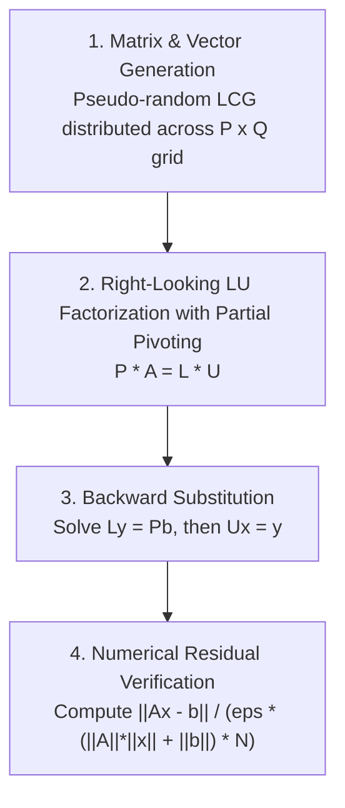

> Historical competition reference. Hardware specifications and performance estimates
> have not been verified by Cabrita’s current release acceptance tests.

# High-Performance Linpack (HPL): Theory, Mechanics & Architecture

This document provides a comprehensive mathematical and algorithmic overview of the **High-Performance Linpack (HPL)** benchmark. It explains how HPL solves dense systems of linear equations, how matrix data is mapped across distributed cluster nodes, and how numerical correctness is verified.

---

## Table of Contents
1. [Introduction & Purpose](#1-introduction--purpose)
2. [Mathematical Problem Formulation](#2-mathematical-problem-formulation)
3. [2D Block-Cyclic Matrix Distribution](#3-2d-block-cyclic-matrix-distribution)
4. [Algorithmic Workflow of HPL](#4-algorithmic-workflow-of-hpl)
5. [Computational Complexity & Arithmetic Intensity](#5-computational-complexity--arithmetic-intensity)
6. [Numerical Stability & Residual Verification](#6-numerical-stability--residual-verification)
7. [References & Standards](#7-references--standards)

---

## 1. Introduction & Purpose

**High-Performance Linpack (HPL)** is the standard benchmark used to evaluate floating-point computing power and rank the world's fastest supercomputers on the [TOP500](https://www.top500.org/) list. 

The primary metric reported by HPL is **$R_{\text{max}}$** (the maximum sustained execution rate in floating-point operations per second, typically expressed in GFLOPS or TFLOPS). Comparing $R_{\text{max}}$ to the theoretical peak performance **$R_{\text{peak}}$** provides the **computational efficiency** ($\eta = R_{\text{max}} / R_{\text{peak}}$) of a supercomputing system.

HPL exercises:
* **Vector Execution Units**: Heavy double-precision floating-point arithmetic (FMA on AVX-512).
* **Memory Hierarchy**: Cache-blocking (`DGEMM`) to maximize reuse in L1/L2 caches.
* **Interconnect Fabrics**: High-throughput collective and point-to-point communications (InfiniBand RDMA) during matrix panel factorization and broadcast.

---

## 2. Mathematical Problem Formulation

HPL measures the time required to solve a system of $N$ dense linear equations with $N$ unknowns:

$$A x = b$$

Where:
* $A \in \mathbb{R}^{N \times N}$ is a randomly generated, dense, non-symmetric square matrix.
* $b \in \mathbb{R}^N$ is the right-hand side column vector.
* $x \in \mathbb{R}^N$ is the unknown solution vector.

### Matrix Generation
To guarantee deterministic execution and eliminate I/O bottlenecks:
1. Matrix entries $a_{ij}$ are generated in memory using a **Linear Congruential Generator (LCG)**:
   $$X_{k+1} = (a \cdot X_k + c) \pmod m$$
2. The values are pseudo-random floating-point numbers uniformly distributed in $[-0.5, 0.5]$.
3. The right-hand side vector $b$ is generated such that $b = \sum_{j=1}^N A_{*, j}$ (row sums of $A$), meaning the theoretical exact mathematical solution is $x = [1, 1, \dots, 1]^T$.

---

## 3. 2D Block-Cyclic Matrix Distribution

In a distributed-memory cluster (such as our 3-node Helvetios environment), matrix $A$ cannot reside within the physical RAM of a single node. Instead, HPL partitions and distributes $A$ across a two-dimensional **$P \times Q$ process grid**.

```
                       Process Grid (P x Q = 2 x 3)
                       Q0           Q1           Q2
                 +------------+------------+------------+
             P0  |  Rank 0    |  Rank 1    |  Rank 2    |
                 +------------+------------+------------+
             P1  |  Rank 3    |  Rank 4    |  Rank 5    |
                 +------------+------------+------------+
```

### Why Block-Cyclic?
During Gaussian elimination (LU factorization), the algorithm systematically eliminates columns from left to right and rows from top to bottom.
* If a simple **1D block** distribution were used (e.g., Rank 0 holds columns $1 \dots 1000$, Rank 1 holds $1001 \dots 2000$), Rank 0 would finish its computation early and sit completely idle for the remainder of the benchmark.
* **Block-Cyclic Distribution** solves this problem by partitioning $A$ into blocks of size $NB \times NB$. These blocks are wrapped cyclically across the $P \times Q$ process grid:
  * Global block $(I, J)$ is mapped to process coordinate $(I \pmod P, J \pmod Q)$.

```
                      Global Matrix A (partitioned into NB x NB blocks)
               Col 0        Col 1        Col 2        Col 3        Col 4
           +------------+------------+------------+------------+------------+
    Row 0  | Block(0,0) | Block(0,1) | Block(0,2) | Block(0,3) | Block(0,4) |
           |  -> (0,0)  |  -> (0,1)  |  -> (0,2)  |  -> (0,0)  |  -> (0,1)  |
           +------------+------------+------------+------------+------------+
    Row 1  | Block(1,0) | Block(1,1) | Block(1,2) | Block(1,3) | Block(1,4) |
           |  -> (1,0)  |  -> (1,1)  |  -> (1,2)  |  -> (1,0)  |  -> (1,1)  |
           +------------+------------+------------+------------+------------+
    Row 2  | Block(2,0) | Block(2,1) | Block(2,2) | Block(2,3) | Block(2,4) |
           |  -> (0,0)  |  -> (0,1)  |  -> (0,2)  |  -> (0,0)  |  -> (0,1)  |
           +------------+------------+------------+------------+------------+
```

As the elimination progresses and rows/columns are retired, all processes continue to participate in calculating the active submatrix until the very last block, maximizing parallel hardware utilization.

---

## 4. Algorithmic Workflow of HPL

HPL solves $Ax = b$ in three distinct computational phases:



### Phase 1: LU Factorization with Partial Pivoting
HPL computes the triangular factorization:

$$P A = L U$$

Where:
* $P$ is a row permutation matrix resulting from partial pivoting (interchanging rows to ensure numerical stability and prevent division by zero or near-zero elements).
* $L$ is a unit lower triangular matrix (diagonal entries equal 1).
* $U$ is an upper triangular matrix.

In each major iteration $k$, the active submatrix has size $(N - k \cdot NB) \times (N - k \cdot NB)$:

```
           +--------------------+--------------------------------+
           |                    |                                |
           |      Computed      |           Computed             |
           |      L and U       |              U                 |
           |                    |                                |
           +--------------------+--------------------------------+
           |     Panel (L)      |                                |
           |   (Width = NB)     |       Trailing Submatrix       |
           |   Pivots found &   |             A_22               |
           |     multipliers    |                                |
           |     calculated     |   Updated via DGEMM:           |
           |                    |   A_22 <- A_22 - L_21 * U_12   |
           +--------------------+--------------------------------+
```

1. **Panel Factorization**:
   The current column block (panel of width $NB$) is factorized. Processes owning columns of this panel perform row searching to find optimal pivot elements, broadcast pivot indices across process columns, and compute multipliers.
2. **Broadcast of $L$ Panel**:
   The computed panel of $L$ is broadcast horizontally across process rows so that all processes can update their respective portions of the trailing submatrix.
3. **Broadcast of $U$ Panel**:
   The corresponding row block of $U$ is broadcast vertically down process columns.
4. **Trailing Submatrix Update (`DGEMM`)**:
   Every process updates its local blocks of the remaining trailing submatrix:
   $$A_{22} \leftarrow A_{22} - L_{21} \cdot U_{12}$$
   This step accounts for over **90% of the total floating-point operations** in HPL and is executed using highly tuned matrix-matrix multiplication kernels (`DGEMM`).

### Phase 2: Backward Substitution
Once factorization is complete ($PA = LU$):
1. The forward elimination solves $L y = P b$ for $y$.
2. The backward substitution solves $U x = y$ for $x$.
Because $U$ is upper triangular, the solution is solved sequentially from the bottom row up to the first row, followed by back-permuting the elements to match the original index ordering.

---

## 5. Computational Complexity & Arithmetic Intensity

### Floating-Point Operation Count
The total number of double-precision floating-point operations required to factorize an $N \times N$ matrix and perform backward substitution is mathematically derived as:

$$\text{FLOPs}_{\text{total}} = \frac{2}{3}N^3 + 2N^2 + O(N)$$

For large $N$ (e.g., $N = 240,000$ on our 3-node cluster):
$$\text{FLOPs} \approx \frac{2}{3} (240,000)^3 \approx 9.216 \times 10^{15} \text{ operations (9.22 PetaFLOPs)}$$

### Arithmetic Intensity
* **Computational Complexity**: $O(N^3)$ operations.
* **Memory Footprint**: $O(N^2)$ elements ($8 \cdot N^2$ bytes).
* **Communication Volume**: $O(N^2)$ words transferred across the network.

Because operations grow with the cube of $N$ while data and communication grow with the square of $N$, the **arithmetic intensity** (FLOPs per byte of memory/network access) increases linearly with $N$:

$$\text{Arithmetic Intensity} \propto \frac{O(N^3)}{O(N^2)} \approx O(N)$$

As $N$ becomes sufficiently large, the cost of communication over InfiniBand and memory fetches from RAM is amortized, and the benchmark becomes entirely **compute-bound**, pushing CPU vector pipelines to near-maximum theoretical limits.

---

## 6. Numerical Stability & Residual Verification

Because floating-point numbers on digital computers have finite precision (53 bits of significand in IEEE 754 double precision), round-off errors accumulate over billions of arithmetic operations.

A Linpack run is **invalid** unless it numerically verifies the correctness of the calculated solution vector $x$.

### The Scaled Residual Formula
HPL computes three scaled residuals. The primary standard residual metric is:

$$r = \frac{\|A x - b\|_\infty}{\varepsilon \cdot \left( \|A\|_\infty \cdot \|x\|_\infty + \|b\|_\infty \right) \cdot N}$$

Where:
* $\| \cdot \|_\infty$ denotes the matrix or vector infinity norm (the maximum absolute row sum).
* $\varepsilon$ is the machine precision for IEEE 754 64-bit floating point ($\varepsilon = 2^{-53} \approx 1.110223 \times 10^{-16}$).
* $N$ is the matrix dimension.

### Pass/Fail Criteria
* **$r < 16.0$**: The computational test **PASSES**. The calculated solution $x$ is backward-stable, meaning the round-off error is within acceptable bounds for Gaussian elimination with partial pivoting.
* In practice, a healthy run on AVX-512 hardware produces $r \ll 1.0$ (typically around $10^{-3}$ to $10^{-2}$).
* If $r \ge 16.0$ or reports `NaN` / `Inf`, the test **FAILS** (indicating hardware faults, thermal memory degradation, or miscompiled BLAS kernels).

---

## 7. References & Standards

1. Petitet, A., Whaley, R. C., Dongarra, J., & Cleary, A. (2018). *HPL - A Portable Implementation of the High-Performance Linpack Benchmark for Distributed-Memory Computers*. Innovative Computing Laboratory, University of Tennessee.
2. Dongarra, J. J., Luszczek, P., & Tourzene, A. (2003). *The LINPACK Benchmark: past, present and future*. Concurrency and Computation: Practice and Experience.
3. Golub, G. H., & Van Loan, C. F. (2013). *Matrix Computations* (4th ed.). Johns Hopkins University Press.
